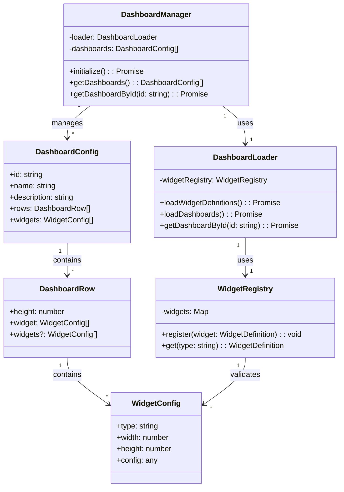

# Dashboard System Architecture

## Class Diagram

This diagram illustrates the core classes and their relationships in the dashboard system:

- **DashboardManager**: Central class that manages dashboard initialization and retrieval
- **DashboardLoader**: Handles loading of widget definitions and dashboard configurations
- **WidgetRegistry**: Maintains registry of available widgets and their definitions
- **DashboardConfig**: Represents a complete dashboard configuration
- **DashboardRow**: Represents a row in the dashboard layout
- **WidgetConfig**: Represents individual widget configurations

The arrows indicate dependencies and relationships between classes, with multiplicities shown where relevant (1 to 1, 1 to many).
